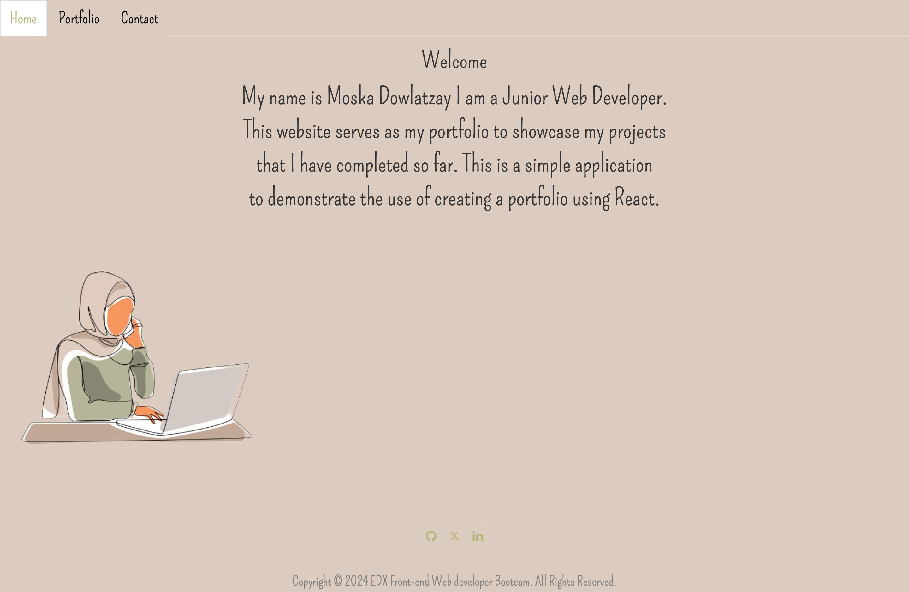
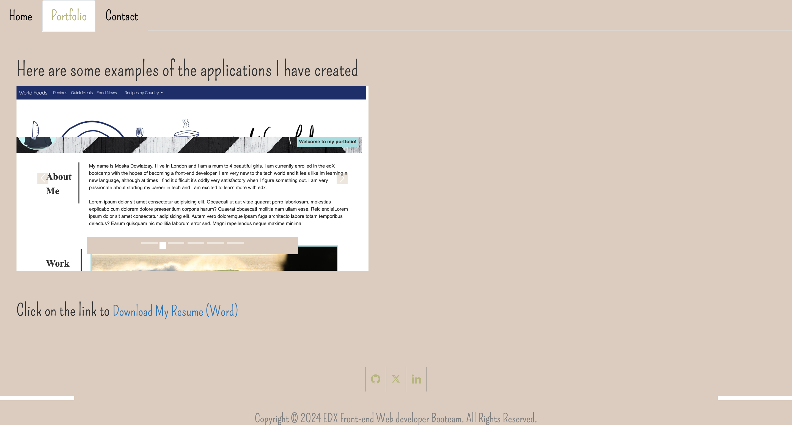
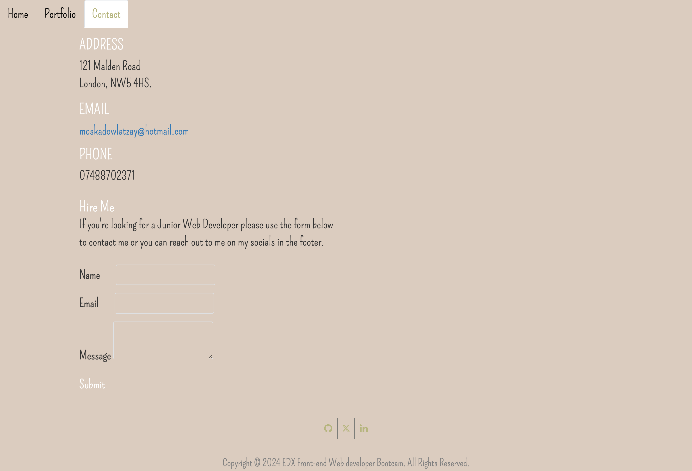

# Moska React Portfolio

# Table of content

[Description](#description)  

[Links](#Links)

[Screenshots](#Screenshots)

[Built_with](#Built_with)

[Credits](#Credits)

## Description 
A personal portfolio created using the React library showcasing my skills and projects I have worked on so far. It includes information about me as well as links to my social media The project is built with a responsive design, allowing users to view it on different devices such as desktop or mobile phones and tablets.
This portfolio application was created using React, vite and bootstrap. It features a landing page, project showcase and a contact form. 

# Links

https://github.com/MoskaDowlatzay/Moska-React-Portfolio

https://moska-react-portfolio.netlify.app

# Built_with 
React + Vite

This template provides a minimal setup to get React working in Vite with HMR and some ESLint rules.

Currently, two official plugins are available:

- [@vitejs/plugin-react](https://github.com/vitejs/vite-plugin-react/blob/main/packages/plugin-react/README.md) uses [Babel](https://babeljs.io/) for Fast Refresh
- [@vitejs/plugin-react-swc](https://github.com/vitejs/vite-plugin-react-swc) uses [SWC](https://swc.rs/) for Fast Refresh

# Screenshot of deployed application

---
© 2023 edX Boot Camps LLC. Confidential and Proprietary. All Rights Reserved.
